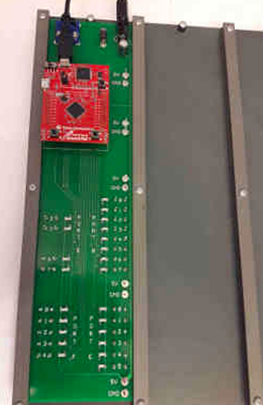
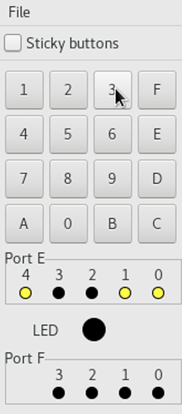
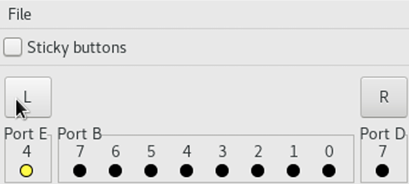
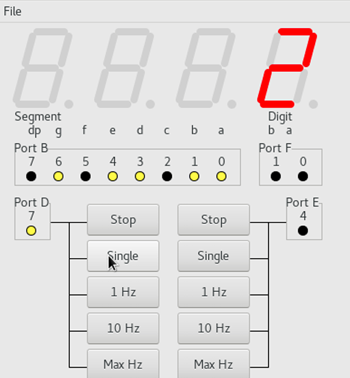
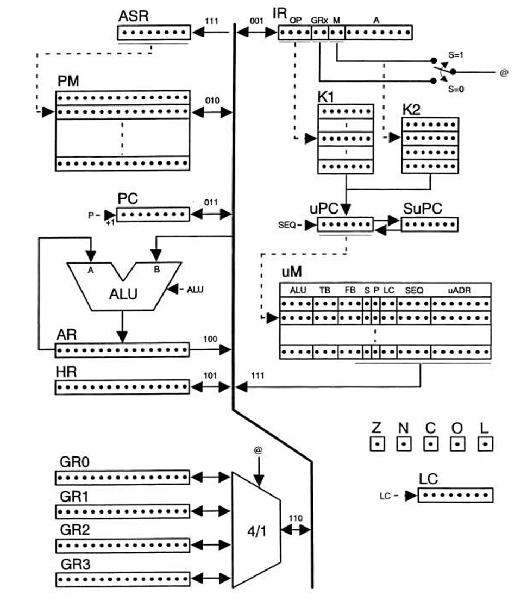

# Assembly lab course
This repository consists of the labs I did in a course about assembly.
Some comments in the labs are in swedish since that was the language of the course.
All our written code is in the "labX.asm" file in each directory, where X is the number of the lab.

## Hardware
We used a private hardware that built on the microcontroller Texas Instruments TM4C123G. It had some external IO-modules like a hexadecimal keypad, a multi-color LED and some others. More details on each module in the information about each lab.

## General lab information

### Lab 1:
This lab was about setting a passcode for the hexadecimal keypad module.
While the passcode was incorrect, the multi-color LED would flash red every second.
If you input the correct passcode, the multi-color LED would shine green.
To "lock" (make it blink red) the passcode while it was "unlocked" (shining green), you would click F on the keypad

### Lab 2:
This lab was using a module with 8 on/off LEDs in a row. The objective was to create a ping pong game. The ball would be a single lit LED travelling across the row of turned off LEDs. Each player controlled a switch they could click. If they clicked when the lit LED reached their side, they would it the ball and it would travel the other way. If they clicked when the ball wasn't there, they would lose. The program also outputted the score to the terminal.

### Lab 3:
This lab was about emulating a timer on a 4 digit seven segment display. Since only one of the 7 segment displays could be lit at once, we would change the currently lit display so fast that the human eye can not see it blinking, similar to how a normal lightbulb works. Once the timer reached 9999, it would restart from 0000.

What the ports controll:
    - Port B - What segments if the currently selected segment would light up
    - Port F - Selects which one of the four segments is the current one. 
       * 00 = right segment (currently active in image), 
       * 01 = middle right segment,
       * 10 = middle left segment,
       * 11 = left segment.
    - Port D - Ticks the timer forward by 1
    - Port E - Increments port F by 1, thus changing the currently selected segment.

### Lab 4:
This lab was very painful. This was the only lab about microprogramming. Given a list of unsorted items in the primary memory (PM in image), our goal was to sort this list using bubblesort. First, we had to write the microcode for the mnemonics LOAD, STORE, ADD, SUB, AND, LSR, BRA, BNE, HALT. Then, using our microcode, we had to write bubblesort. The result was that our program managed to sort a list of 32 items in ~70 000 clockcycles where the requirement was below 100 000 for the lab.

### Lab 5:
This lab was about optimizing a pre-written program that would display part of a bigger image, while moving in a circle to show different parts of the image. The program was unoptimized so that it would run much slower when the "camera" showing the image was at a 90 or 270 degree angle from the original orientation. Our job was to analyze the cache and improve the program so that it didn't slow down once it reached 90 and 270 degrees.
